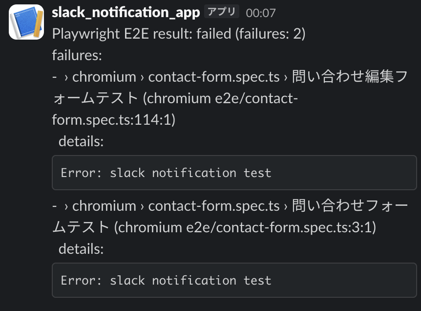

## playwright-slack-notification

Playwrightの実行結果をSlackへ通知するための`npm package`です。

## 使い方

### 1. インストール

```bash
npm i playwright-slack-notification
```

### 2. 通知方式を選んで設定する

この package には 2 つの設定方式があります。


- Webhook方式（デフォルト）の場合の通知
  - シンプルな単一メッセージ
  - スレッド非対応
  - エラー詳細は本文に直接記載

### Bot Token方式の場合の通知  
  - メイン投稿＋スレッド投稿が可能
  - `errorDetailsInThread: true`でエラー詳細をスレッドに分離
  - より見やすい階層構造

#### A. Incoming Webhook 方式

`.env` に Webhook URL を設定します.

```env
SLACK_WEBHOOK_URL=YOUR_WEBHOOK_URL
```

#### B. Slack Bot Token 方式

`.env` に Bot Token と Channel ID を設定します：

```env
SLACK_BOT_TOKEN=xoxb-...
SLACK_BOT_CHANNEL_ID=C1234567890
```

必要な Bot Scope（OAuth & Permissions）:

- `chat:write`（必須）
- `chat:write.public`（任意: Bot 未参加の public channel に投稿する場合）

Bot 方式を使う場合、Webhook URL (`SLACK_WEBHOOK_URL`) は不要です。

### 3. 任意のタイミングで通知を送る場合

```ts
import { sendNotification } from 'playwright-slack-notification';

await sendNotification('E2E tests passed ✅');
```


### 4. Playwright の結果を自動通知する

####  Reporter を設定

Reporter を `playwright.config.ts` に設定します：

```ts
export default defineConfig({
  reporter: [
    ['list'],
    ['playwright-slack-notification/reporter', {
      sendNotificationOnSuccess: false,
      showErrorDetails: true,
    }],
  ],
  // ... 他の設定
});
```

Webhook 方式で使う場合は上記のみで OK です。

Bot 方式でスレッド投稿したい場合は `errorDetailsInThread: true` を指定します：

```ts
export default defineConfig({
  reporter: [
    ['list'],
    ['playwright-slack-notification/reporter', {
      sendNotificationOnSuccess: false,
      showErrorDetails: true,
      errorDetailsInThread: true,
      splitThreadMessagePerTest: true, // 各テストごとに個別のスレッドメッセージを投稿
    }],
  ],
});
```

`sendNotificationOnSuccess` の指定:

- `false`（デフォルト）: 失敗時のみ Slack 通知
- `always`: 成功時にも Slack 通知

`errorDetailsInThread` の指定:

- `false` (デフォルト): エラー詳細をメイン通知本文に含める
- `true`: Slack bot user でエラー詳細をスレッド投稿する
  - スレッドには各テストの名前、ロケーション、完全なエラー詳細（スタックトレース含む）が表示されます

`splitThreadMessagePerTest` の指定:

- `false` (デフォルト): 全てのエラー詳細を1つのスレッドメッセージに統合
- `true`: 各失敗テストごとに個別のスレッドメッセージを投稿
  - 多数のテストが失敗した場合、Slackのメッセージサイズ制限（40,000文字）を超えないようにするために有効
  - Bot Token方式でのみ使用可能（`errorDetailsInThread: true` と併用）
  - Webhook方式では無視され、通常の本文表示になります

`showErrorDetails` の指定（Webhook / Bot 共通）:

- `true` (デフォルト): エラーの詳細情報（スタックトレース、コードスニペット含む）を表示
  - Webhook方式: テスト名 + `details:` セクションにコードブロックでエラー全文（コードスニペット、行番号付き）を表示
  - Bot Thread方式: メイン投稿はテスト名のみ、スレッドにエラーサマリー（コードスニペット含む）を投稿
  - **タイムアウトエラー**: タイムアウトの原因となった操作（例: `page.click()`, `page.waitForSelector()` など）のコードスニペットも含まれます
- `false`: エラーの詳細を非表示（テスト名とロケーションのみ通知）
  - どちらの方式でもエラー内容は表示されません

**表示例（Webhook方式、`showErrorDetails: true`）:**


